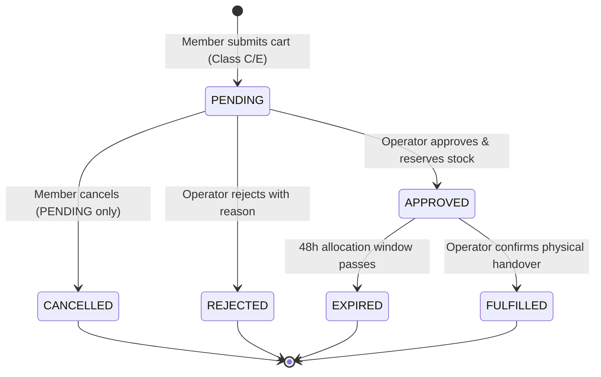
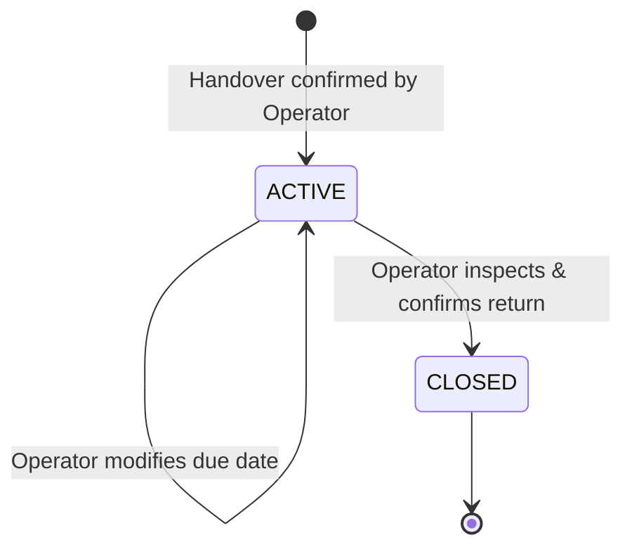

# Pre-Backend Domain Contract & Freeze Specification

## 1. Architecture Overview & Freeze Scope

This document specifies the exact domain model, security boundaries, and data invariants established during the **Final Pre-Backend Freeze** of `ieee-ras-insat-logistics`. It serves as the authoritative contract for the subsequent Stage 4 backend implementation (D1, Drizzle, Hono, Cloudflare Workers, Better Auth).

Zero backend server code exists in this stage. All contracts and mock implementations reflect the frontend requirements, access control matrices, and data privacy invariants.

---

## 2. Canonical Identity & RBAC Matrix

### 2.1 Canonical Roles

The system strictly recognizes **three (3)** roles:

1. `MEMBER`: General student borrowers, club members, project contributors.
2. `OPERATOR`: Logistics desk managers, executive board officers, Eurobot team leads.
3. `SUPERADMIN`: Chapter presidents, systems administrators, high-clearance managers.

> **Deprecated / Prohibited Roles**: `BOARD` has been completely deleted as an independent role string. Authorized identity administration may assign `OPERATOR` and Clearance Level V to verified executive affiliations (`RAS_BOARD`, `EUROBOT`); affiliation or project assignment alone does not grant either.

Roles are resolved from the authenticated actor's user profile for every mutation. Callers cannot authorize an action by supplying an actor role, display name, clearance, or project membership. Project membership grants project context only; role, affiliation, and clearance changes belong to authorized identity-administration workflows.

### 2.2 Clearance Hierarchy

- **Level I**: External / Guest borrowers (unverified).
- **Level II**: Affiliated club members (Aerobotix).
- **Level III**: Verified IEEE RAS INSAT members (Standard).
- **Level IV**: Project leads, specialized workshop managers (elevated via manual clearance).
- **Level V**: Logistics desk operators and chapter board officers.
- **Level VI**: Systems superadministrators.

### 2.3 Access Control Boundaries

| Area / Action                            | MEMBER                    | OPERATOR     | SUPERADMIN  |
| ---------------------------------------- | ------------------------- | ------------ | ----------- |
| Browse Borrower Catalogue                | Read-only (Privacy DTO)   | Full Access  | Full Access |
| Submit Online Equipment Request          | Class C & E only          | Forbidden    | Forbidden   |
| Member Activity View                     | Own requests & loans      | Full Access  | Full Access |
| Logistics Dashboard (`/board`)           | **Forbidden** (Redirects) | Full Access  | Full Access |
| Approve / Reject Requests                | Forbidden                 | Yes          | Yes         |
| Physical Equipment Handover              | Forbidden                 | Yes          | Yes         |
| Direct Loan Due-Date Adjustment          | Forbidden                 | Yes          | Yes         |
| Physical Return & Inspection             | Forbidden                 | Yes          | Yes         |
| Inventory Asset Management               | Forbidden                 | Read / Write | Full Access |
| Direct Ownership Correction / Retirement | Forbidden                 | Forbidden    | Yes         |
| Physical Audit Correction                | Forbidden                 | Yes          | Yes         |
| Audit Trail Inspection                   | Forbidden                 | Read-only    | Full Access |
| Strike Levels 1–4                        | Forbidden                 | Yes          | Yes         |
| Strike Level 5 / Permanent Blacklist     | Forbidden                 | Forbidden    | Yes         |

---

## 3. Inventory Model & Stock Conservation

### 3.1 Equipment Classes & Online Request Gating

| Class       | Designation               | Online Request Allowed | Policy / User Feedback                                 |
| ----------- | ------------------------- | ---------------------- | ------------------------------------------------------ |
| **Class A** | Consumables               | **No**                 | In-workshop use only; cannot be borrowed online.       |
| **Class B** | Small Components          | **No**                 | Workshop only / direct kit distribution.               |
| **Class C** | Modules / Sensors         | **YES**                | Available for online cart and request.                 |
| **Class D** | Hand Tools                | **No**                 | In-workshop access only.                               |
| **Class E** | Development Boards & Kits | **YES**                | Available for online cart and request.                 |
| **Class F** | Workshop Heavy Machines   | **No**                 | Operator supervision required; in-person request only. |
| **Class G** | High-Value / Restricted   | **No**                 | Special authorization only; in-person board request.   |

Attempts to submit requests with Class A, B, D, F, or G items via handcrafted payloads must be rejected by service and API boundaries with an explicit domain error: `"Only Class C and E can be requested online"`.

### 3.2 Borrower Stock Privacy DTO

Borrowers consume `BorrowerCatalogItem`, which hides internal tracking and physical storage details:

- **Exposed to Borrower**: `id`, `name`, `description`, `category`, `imageUrl`, optional `datasheetUrl`, `availability` (`AVAILABLE` | `LIMITED` | `UNAVAILABLE`), and `action` (`REQUEST` | `ASK_OPERATOR` | `WORKSPACE` | `NONE`).
- **Strictly Redacted from Borrower**:
  - `totalQuantity`, `availableQuantity`, `allocatedQuantity`, `borrowedQuantity`, `damagedQuantity`, `maintenanceQuantity`, `lostQuantity`.
  - `storageLocation` (Cabinet, Shelf, Bin).
  - `trackingMode` (`INDIVIDUAL_ASSET` vs `QUANTITY`).
  - `assets` (Serial numbers, asset IDs, individual purchase dates, condition tags).
  - Internal minimum clearance requirement.

### 3.3 Stock Quantity Conservation Invariant

For every equipment item, the sum of all state quantities must equal `totalQuantity`:
$$\text{totalQuantity} = \text{availableQuantity} + \text{allocatedQuantity} + \text{borrowedQuantity} + \text{damagedQuantity} + \text{maintenanceQuantity} + \text{lostQuantity}$$

- **On Approval**: $\text{availableQuantity} \leftarrow \text{availableQuantity} - N$, $\text{allocatedQuantity} \leftarrow \text{allocatedQuantity} + N$.
- **On Handover**: $\text{allocatedQuantity} \leftarrow \text{allocatedQuantity} - N$, $\text{borrowedQuantity} \leftarrow \text{borrowedQuantity} + N$.
- **On Return (GOOD)**: $\text{borrowedQuantity} \leftarrow \text{borrowedQuantity} - N$, $\text{availableQuantity} \leftarrow \text{availableQuantity} + N$.
- **On Return (DAMAGED)**: $\text{borrowedQuantity} \leftarrow \text{borrowedQuantity} - N$, $\text{damagedQuantity} \leftarrow \text{damagedQuantity} + N$.
- **On Return (LOST)**: $\text{borrowedQuantity} \leftarrow \text{borrowedQuantity} - N$, $\text{lostQuantity} \leftarrow \text{lostQuantity} + N$.
- **On Cancellation / Expiry**: $\text{allocatedQuantity} \leftarrow \text{allocatedQuantity} - N$, $\text{availableQuantity} \leftarrow \text{availableQuantity} + N$.

---

## 4. State Machines & Lifecycles

### 4.1 Borrow Request Lifecycle

### 4.2 Allocation Reservation Expiry

- When an operator approves a request, stock is reserved via `allocatedQuantity` and an `AllocationRecord` is created with an `expiresAt` timestamp set to exactly **48 hours** from approval.
- If the member fails to pick up the equipment within 48 hours, the allocation transitions to `EXPIRED`, restoring `allocatedQuantity` back to `availableQuantity`.

### 4.3 Loan Lifecycle & Physical Return Inspection

- **Physical Inspection Conditions**:
  - `GOOD`: All units functional $\rightarrow$ stock restored to `available`.
  - `MINOR_ISSUE`: Functioning with minor defect $\rightarrow$ stock restored to `available` with maintenance note.
  - `DAMAGED`: Units move to `damagedQuantity`; condition notes and inventory history are recorded. The operator may explicitly request a damage incident. No strike recommendation or punishment is generated by the return itself.
  - `LOST`: Equipment lost $\rightarrow$ units moved to `lostQuantity`.

> **Notice**: Members cannot declare returns or request extensions online. Physical return occurs exclusively in-person at the logistics desk.

---

## 5. Disciplinary & Audit Models

### 5.1 Strike Lifecycle and Operator Escalation

- A `StrikeRecord` is active only when its status is `ACTIVE` and it has no expiration or expires after the current time. Active counts and derived user restrictions are calculated from strike records; `strikesCount` is a read projection, never the source of truth.
- Strike levels 1–4 require an active operator. Strike 5 and permanent blacklist changes require a superadmin.
- A damage incident is created only when the operator explicitly requests escalation during return inspection. Incidents do not issue or recommend strikes automatically.
- Accounts with 4 or more active strikes are barred from creating online requests. Strike 4 applies a restriction through its configured semester end; semesters are selected by their current date range.

### 5.2 Physical Audit and Correction

- Physical stock on site is `available + allocated + damaged + maintenance`. Borrowed and lost equipment is not on site.
- Audit start snapshots this physical quantity. Later inventory events adjust expected physical quantity by the change in this same on-site formula.
- A discrepancy is `physicalCount - adjustedExpectedQuantity` and may be positive or negative. Positive corrections add available stock; individually tracked additions require one unique serial number per unit. Negative corrections remove the explicitly identified available unit(s) from the owned inventory registry and total. Individually tracked removals require exact asset identifiers.
- Each reconciliation records before/after inventory state, signed quantity, reason, actor, and timestamp in an `InventoryEvent` and `AuditEvent`. Retirement follows the same registry invariant: retired units are removed from owned total and asset registry, with a superadmin-authorized event.

### 5.3 Structured Audit Logging

Every critical mutation emits an immutable `AuditEvent`:

- `REQUEST_CREATED`, `REQUEST_APPROVED`, `REQUEST_REJECTED`, `REQUEST_CANCELLED`
- `EQUIPMENT_HANDOVER`
- `LOAN_DUE_DATE_UPDATED`, `LOAN_RETURNED`
- `INVENTORY_ADJUSTED`, `ASSET_STATE_CHANGED`
